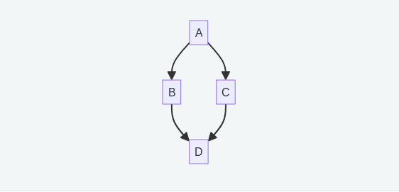
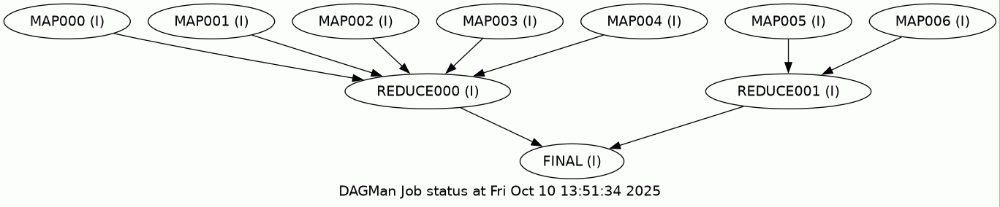

# Utilizing parallelism on OrangeGrid

HTcondor is a "high throughput" scheduler, meaning its strength is in running 
lots of relatively small jobs simultaneously, in parallel.  Sometimes research 
naturally fits into this pattern, such as a study that explores 100 different 
sets of parameters and can run each set independently.  In other cases the 
problem may not divide up as simply, but even then there are general techniques 
that can be used to split a single large or slow program into smaller parts.

A common issue that arises when considering how to split up such a program is 
how data should be managed.  If a program utilizes global data structures that 
can change during the program's run then data management becomes much more 
difficult since different parts or steps of the code must be aware of each other 
and somehow coordinate their access to these structures.  This document 
therefore focuses on techniques adapted from
[functional programming](https://en.wikipedia.org/wiki/Functional_programming).

While a full discussion of this topic is outside the current scope, readers may 
wish to familiarize themselves with some of the ideas for application in their 
own work, even when not using a purely functional language or style.  Here we 
will focus on two very general and powerful techniques *map* and *reduce*.


## Map: changing data

To start, consider the simple problem of squaring every value in an array of 
integers.  In Python this might naively be done as

```python

initial_array = [1,2,6,12,18]
new_array = []

for value in initial_array:
    new_array.append(value * value)
```

This represents a standard programming construct, iterating over some collection 
of values and doing something with each.  This can be written more compactly and 
more in keeping with the "Python style" by using a *list comprehension*.

```python

initial_array = [1,2,6,12,18]
new_array = [v * v for v in initial_array]
```

In this case the list comprehension is equivalent to using Python's 
[map](https://docs.python.org/3.13/library/functions.html#map) function.  Map 
applies a function to every element of an array.  In order to do that the first 
argument to map is itself a function.  For some readers the idea of passing a 
function to another function may seem weird, but in Python a function is just a 
"thing" like any other "thing" such as an integer or string.  A function can 
take a function as an argument or return a new function, just as a function can 
take a string as an argument or return a new string.  This ability to treat 
functions as *first-class objects* is a key insight from functional programming.  

The code written using map looks like this:

```python

def square(v):
    return v*v
    
initial_array = [1,2,6,12,18]
new_array = map(square, initial_array)
```

There is still one difference between functions and other types here.  Generally 
it is not necessary to give something a variable name before using it.  The 
first array could be totally eliminated by writing it as

```python

def square(v):
    return v*v
    
new_array = map(square, [1,2,6,12,18])
```

So if functions are treated the same as anything else it should be possible to 
create one without giving it a name.  This is done through the *lambda* keyword
(the name comes from [lambda 
calculus](https://en.wikipedia.org/wiki/Lambda_calculus), a mathematical 
formulation of functional programming.

```python
    
new_array = map(lambda v: v*v, [1,2,6,12,18])
```

This is about as far as we'll go into functional programming!

The key thing to notice here is that every element of `new_array` is calculated 
independently.  So rather than doing the first, then the second, and so on why 
not do them all at once, in parallel.  Even before bringing in HTCondor the work 
can be split among several CPUs.  In Python the built-in 
[multiprocessing](https://docs.python.org/3.13/library/multiprocessing.html#module-multiprocessing) 
module makes this easy.

```python
from multiprocessing import Pool

number_of_cpus = 5

with Pool(number_of_cpus) as p:
     new_array = p.map(lambda v: v*v, [1,2,6,12,18])
```

Just replace `map` with `Pool.map`.  In a situation where the function is very 
slow this can enable the program to run in almost one fifth of the time!  

To run a program like this under HTCondor it is also necessary to tell the 
system how many CPUs the program will need.  This is done with the 
`request_cpus` option in the submit file.

```
executable = squares.py

request_cpus = 5

queue
```


### Multiple arguments

In this example the square function only needs one value, but what if the 
problem requires multiplying the values in two arrays?

```python

array1 = [2,3,4,5]
array2 = [5,6,7,8]
result = []

for i in range(len(array1)):
    result.append(array1[i] * array2[i])
```

As the saying goes, when all you have is a hammer everything looks like a nail.
If all you have is a way of dealing with functions that take only one argument,
then make all your data look like a single value!  In this case two lists can
be transformed into one list of two values with the zip function

```python

print(list(zip(array1, array2)))

[(2,5), (3,6), (4,7), (5,8)]
```

This can now be used in `map`:


```python

from multiprocessing import Pool

def multiply(values):
    v1, v2 = values
    return v1*v2

array1 = [2,3,4,5]
array2 = [5,6,7,8]

number_of_cpus = 5

with Pool(number_of_cpus) as p:
     result = p.map(multiply, list(zip(array1, array2)))
```

Or more compactly using a lambda expression

```
     result = p.map(lambda v: v[0]*v[1], list(zip(array1, array2)))
```


### Mapping over values with HTCondor

Although HTCondor doesn't exactly have a map function it does provide some 
powerful mechanisms in the `queue` command which can be thought of as doing the 
same thing.  To start with, in moving from a single program to an HTCondor batch 
of programs, functions get replaced by programs.  Arguments to the function 
become command-line arguments, and instead of returning a value the result is 
printed.

```python

def multiply(values):
    v1, v2 = values
    return v1*v2

```

Becomes

```python

# multiply.py
import sys

v1 = int(sys.argv[1])
v2 = int(sys.argv[2])

print(v1 * v2)
```


The set of arguments gets stored in an auxiliary file, in this case called 
`values.dat` containing the zipped pairs

```
2 5
3 6
4 7
5 8
```

Then the submit file ties everything together and does the mapping

```
executable = multiply.py
arguments  = $(arg1) $(arg2)

output     = result_$(Process).dat
error      = multiply_$(Process).err
log        = multiply_$(Process).log

queue arg1, arg2 from values.dat
```

The `Process` variable is handled by HTCondor, it is automatically set to 0 for 
the first job, 1 for the second and so on.  Note that here the `request_cpus` 
line isn't necessary.  Each instance of `multiply.py` uses only one CPU, the 
parallelisation is managed by HTCondor running one of these instances for each 
line in `values.dat`.  When the batch completes the results will be scattered 
across files called `result_1.dat`, `result_2.dat` etc.  It is possible to have 
HTCondor combine all the results into one file after all the jobs have run, that 
will be discussed in a section below on HTCondor *Dagman*.


# Reduce: Combining a set of values into one result

Next, consider the problem of adding up a list of values

```python

values = [1,2,4,7,12]

total = 0 

for value in values:
    total = total + value
```

This is an example of a general *reduce* pattern that, once you start looking
for it, turns up everywhere.

```python

values = ...

accumulator = an_initial_value

for value in values:
    accumulator = some_function(accumulator, value)
```

The pattern is sometimes hidden, for example, consider an array that contains
values from 0 to 9 and we want to general a count of how many times each number
appears

```python

values = ...

accumulator = [0,0,0,0,0,0,0,0,0,0]

for value in values:
    accumulator[value] += 1
```

While the step inside the loop doesn't seem to have the right form this is
because in Python, as in most languages, data structures and variables are
*mutable*, they can be changed over the course of the computation.  This not
only hides the reduce pattern but makes it harder to think about parallelism,
again because if different threads of execution are modifying a data structure
at the same time they might not happen in the right order, or might overwrite
each other.  This is another instance where thinking functionally can help, 
because in functional languages data structures and variables can not be changed
once created.  In this case that means that we'll have to create a new array 
each time through the loop.

```python

def increment_counter(array, index_to_increment):
    return [index == index_to_increment and value+1 or value for index,value in enumerate(array)]

values = ...

accumulator = [0,0,0,0,0,0,0,0,0,0]

for value in values:
    accumulator = increment_counter(accumulator, value)
```

Now this fits the general pattern.  This is so common that Python even supplies
a function, [functools.reduce](https://docs.python.org/3/library/functools.html#functools.reduce),
to encapsulate it.  The previous example is equivalent to


```python

from functools import reduce

def increment_counter(array, index_to_increment):
    return [index == index_to_increment and value+1 or value for index,value in enumerate(array)]

values = ...

accumulator = reduce(increment_counter, values, [0,0,0,0,0,0,0,0,0,0])

```

## Parallelizing reduce operations

Although there is no built-in `pool.reduce` method we can still think about how
such operations could be parallelized.  Going back to the example of summing up
a list, one obvious thing we could do is reduce each half of the array
separately, possibly in parallel, and then adding the results

```python

from functools import reduce
from operator import __add__

values = ...

middle_index = len(values)//2

result = reduce(__add__, values[:middle_index], 0) + \
         reduce(__add__, values[middle_index:], 0) 
```

The number of parallel reductions could be changed based on the size of the
problem and the number of available CPUs.


## A subtlety and some math

This section can be skipped but is provided for anyone who might find this a useful way
to think about things.

Extending the idea of splitting into multiple reduce calls to the histogram example 
would require an auxiliary function to combine the partial results

```python

from functools import reduce

def increment_counter(array, index_to_increment):
    return [index == index_to_increment and value+1 or value for index,value in enumerate(array)]

def add_arrays(arr1, arr2):
    return [v[0] + v[1] for v in zip(arr1, arr2)]

values       = ...
middle_index = len(values)//2

accumulator1 = reduce(increment_counter, values[:middle_index], [0,0,0,0,0,0,0,0,0,0])
accumulator2 = reduce(increment_counter, values[middle_index:], [0,0,0,0,0,0,0,0,0,0])
accumulator  = add_arrays(accumulator1, accumulator2)

```

This is because, in general, the type of the accumulator (here `list[int]`) is different
from the type of the elements of the values list (in this case `int`).  It can be easier
to reason about reductions when they're the same, because this means that combining the 
intermediate reductions is *itself* a reduction!  

Consider a list of 40 elements to be added together, split into 4 pieces.  Each piece can be
reduced independently, then the total is one last reduce.

```python

results = [reduce(__add__, values[ 0:10], 0),
           reduce(__add__, values[10:20], 0),
           reduce(__add__, values[20:30], 0),
           reduce(__add__, values[30:40], 0)]

result = reduce(__add__, results, 0)
```

There's an elegant way to express when this is possible.

A *monoid* is a set, denoted `S` and an operator denoted `•` with the
following properties:

  * For all elements *a* and *b* in `S`, *a • b* is also an element of `S`
  * There is an special element called the identity denoted `e` such that, 
    for all *a* in `S` *a • e = e • a = a*
  * The operator is associative, for all *a,b,c* in `S`,
    *(a • b) • c = a • (b • c)*.  This means we can ignore parenthesis.

Note that it is *not* necessary that *a • b = b • a*.

Some examples:

  * Integers with addition, the identity element is 0
  * Strings with string concatenation, the identity element is the empty string ""
  * Booleans with `and`, the identity element is `True` 

Employing this language we can say that reduce operations have the simplest and
most flexible form when operating on a monoid.  In pseudo-Python

```python

values : List[S] = ...
identity : S = ...

result = reduce(•, values, identity)
```

If the problem isn't intrinsically in this form it can sometimes be possible
and useful to first convert the elements in the `values` array to the type of
the accumulator, which can often be done via `map`.  For the histogram example:

```python

from functools import reduce

def value_to_array(value):
    return [index == value and 1 or 0 for index in range(0,10)]

def add_arrays(arr1, arr2):
    return [v[0] + v[1] for v in zip(arr1, arr2)]

values        = ...
monoid_values = map(value_to_array, values)
middle_index  = len(values)//2

accumulator1 = reduce(add_arrays, monoid_values[:middle_index], [0,0,0,0,0,0,0,0,0,0])
accumulator2 = reduce(add_arrays, monoid_values[middle_index:], [0,0,0,0,0,0,0,0,0,0])
accumulator  = add_arrays(accumulator1, accumulator2)

```

This now has exactly the same form as the list summation example.


# Structuring HTCondor jobs with DAGMan

As we move into more complex combinations of map and reduce we'll need a
mechanism to structure the whole computation workflow.  As an example, when
splitting a reduction into several pieces we need to first do each of the
sub-reductions, then combine them into the final result.  HTCondor
provides a tool named [DAGMan](https://htcondor.readthedocs.io/en/latest/automated-workflows/dagman-introduction.html) 
which handles this.

DAGMan processes a "directed acyclic graph" (DAG) describing the relationship 
between jobs.  This is taken from the documentation, but consider a job A that 
sets up some data, jobs B and C which process that data in parallel, and then
a final job D that combines the result.  This relationship looks like




The corresponding DAG file is

```
# File name: diamond.dag

JOB A A.sub
JOB B B.sub
JOB C C.sub
JOB D D.sub
PARENT A CHILD B C
PARENT B C CHILD D
```

The first four lines name the jobs and give corresponding submit files.  Then
the first PARENT line says that job A must be run before jobs B and C, and the
second says that jobs B and C must be run before D.

## Map in DAGman

In this model a map operation can be as simple as

```
JOB A A.sub
JOB B B.sub
JOB C C.sub
JOB D D.sub
...
```

as there is no dependancy between jobs.  Even simpler, it is often possible to use a single
submit file with a parameter.  If we have a simple Python program, `square.py` that squares its argument

```python
import sys

n=int(sys.argv[1])
print(n * n)
```

and a corresponding submit file, `square.sub` that uses a parameter as the argument

```
executable = square.py
argument   = $(value)
```

Then the dag file could be

```
JOB A square.sub
JOB B square.sub
JOB C square.sub

VARS A value=6
VARS B value=10
VARS C value=23
...
```

## Reduce in DAGman

Here things start to get a little more complicated.  We'll need one job for each
sub-reduce operation, these will act as the parent to a job that combines the results.
For the example of summing a list of numbers, we'll use a Python program that takes 
as arguments the name of a file with the values, the index of the first row to include,
and the index of the final row to include

```python

import sys

filename  = sys.argv[1]
first_row = int(sys.argv[2])
last_row  = int(sys.argv[3])

data      = [int(l.strip()) for l in open(filename)]
result    = sum(data[first_row:last_row])

print(result)
```

The submit file will be

```
executable = sum.py
arguments  = $(filename) $(first_row) $(last_row)

output     = out_$(id).dat
```

and to start with the dag will look like this, if the data file has 10 rows and we split
it into two equal pieces

```
JOB A sum.sub
JOB B sum.sub

VARS A filename="values.dat", id="001", first_row=0, last_row=5
VARS B filename="values.dat", id="002", first_row=5, last_row=10
```

The next step is to combine the sub results, and here's where we can use the
fact that integers under addition form a monoid to make things easy!  To
combine the results we just need to combine the result files into a single new
data file, then use the same python and submit files to sum it.  The combination can be
done with an auxiliary shell file

```bash

ls -1 out_*.dat | sort | xargs cat > intermediate.dat
```

The final dag file then looks like

```
JOB A sum.sub
JOB B sum.sub
JOB C combine_lines.sub
JOB D sum.sub

VARS A filename="values.dat", id="001", first_row=0, last_row=5
VARS B filename="values.dat", id="002", first_row=5, last_row=10
VARS D filename="intermediate.dat", id="final", first_row=0, last_row=2

PARENT A B CHILD C
PARENT C   CHILD D
```

# Putting it together: adding up a list of squares

As the last section showed, dag files can get large quickly even for simple tasks.
Users will rarely write dag files by hand, instead usually a program is used to 
generate the dag file based on the "shape" of the data, for example the length of a
list to be processed.

This directory includes a `generate_dag.py` example, it takes a list of numbers
as arguments.  Each number is squared in a separate map operation, then the
total is computed by splitting the list into groups of five numbers.  This
splitting is hierarchical, if asked to work on 10 numbers there will be 10 map
jobs and three reduce jobs (one for the first five numbers, one for the second
five numbers, and one for the resulting two numbers).  If asked to work on 35
numbers there will be 30 map jobs and 9 reduce jobs (one for each initial group
of 5 numbers making a group of 7, one for the first five in this new group and
one for the last two in the new group, giving another new group of 2, and then
one last one adding these final two).

You can see it in operation with, for example

```bash

python3 generate_dag.py 1 2 3 4 5 10 11 > sum_squares.dag
condor_submit_dat sum_squares.dag
```

After running the result will be in `FINAL.dat`
 
One nice feature of DAGMan is that it can generate a visual representation of
the jobs and their dependancies.  This image can even be made to update
as jobs complete.  This image is initially in the `dot` format of [Graphviz](https://graphviz.org/),
which can be installed through [Conda](https://anaconda.org/anaconda/graphviz).  The image
can be converted to a png with the command

```bash
dot -Tpng:cairo:gd sum_squares.dot -o sum_squares.png
```

In this case this results in this image:




## Conclusion: thinking paralelly

As a final example let's look at matrix multiplication.  As a reminder from 
Wikipedia [matrix multiplication](https://en.wikipedia.org/wiki/Matrix_multiplication) is defined as:

If _A_ is an m × n matrix and _B_ is an n × p matrix, 


the matrix product _C = AB_ (denoted without multiplication signs or dots) is defined to be the m × p matrix


such that


In straightforward Python code this would be implemented as follows 
(note that the order of the indices is correct, in 
mathematical notation A<sub>i,j</sub> means the i'th row  and j'th
column, whereas in Python `A[i][j]`  it's the same)

```python
A = [[1,2,3],
     [4,5,6],
     [7,8,9]]

B = [[2,4,6],
     [1,3,5],
     [9,8,7]]

C = [[0 for _ in range(len(A[0]))] for _ in range(len(B))]

for i in range(len(A)):
    for j in range(len(B[0])):
        for k in range(len(B)):
            C[i][j] += A[i][k] * B[k][j]
```


As a general rule, whenever a program has a loop there's likely to be a candidate
for parallelization, if a value is being modified on each iteration then there may
be an opportunity to use reduce, and if not then there may be an opportunity for map.

Looking at the innermost loop over `k`, there are two patterns we've seen before; 
the product of two lists, and a sum over a list.  This suggests rewriting as

```python

from functools import reduce
from operator import __add__

A = [[1,2,3],
     [4,5,6],
     [7,8,9]]

B = [[2,4,6],
     [1,3,5],
     [9,8,7]]

C = [[0 for _ in range(len(A[0]))] for _ in range(len(B))]

for i in range(len(A)):
    for j in range(len(B[0])):
        pairs    = [(A[i][k], B[k][j]) for k in range(len(B))]
        products = map(lambda v:v[0]*v[1], pairs)
        C[i][j]  = reduce(__add__, products, 0)
```

At the outer level there are nested loops over i and j, and certainly this could
be turned into nested calls to map.  However in this case it makes things somewhat
simpler to note that the effect of these loops is to iterate over all combinations
of i and j, that is, all pairs of (i,j).

```python

indicies = [(i,j) for i in range(len(A)) for j in range(len(B[0]))]

for i,j in indicies:
    pairs    = [(A[i][k], B[k][j]) for k in range(len(B))]
    products = map(lambda v:v[0]*v[1], pairs)
    C[i][j]  = reduce(__add__, products, 0)
```

This now looks a little more like previous map examples, although with one 
difference.  Previous examples have transformed the values in one list into
values in the result,

```python

def isEven(x):
    return x % 2 == 0

maybeEven = map(isEven,[1,2,3,4])
```

turns a list of ints into a list of bools.  In this case however
what is being transformed is the list of index pairs *in the context or A and B*.
This isn't a huge difference, but it does mean that the context needs to be
included in the map.

```python

def handleOneEntry(A, B, index):
    i,j      = index
    pairs    = [(A[i][k], B[k][j]) for k in range(len(B))]
    products = map(lambda v:v[0]*v[1], pairs)
    
    return reduce(__add__, products, 0)

indicies = [(i,j) for i in range(len(A)) for j in range(len(B[0]))]
entries  = map(lambda index: handleOneEntry(A, B, index), indicies)
```

There is then just one final step, `entries` will contain a single 
list where we want C to be a list of lists representing a matrix.  
Adding this gives the final version of the program.

```python

from functools import reduce
from operator import __add__

A = [[1,2,3],
     [4,5,6],
     [7,8,9]]

B = [[2,4,6],
     [1,3,5],
     [9,8,7]]

def handleOneEntry(A, B, index):
    i,j      = index
    pairs    = [(A[i][k], B[k][j]) for k in range(len(B))]
    products = map(lambda v:v[0]*v[1], pairs)
    
    return reduce(__add__, products, 0)

indicies = [(i,j) for i in range(len(A)) for j in range(len(B[0]))]
entries  = map(lambda index: handleOneEntry(A, B, index), indicies)
C        = [[entries[i*len(B[0])+j] for j in range(len(B[0]))] for i in range(len(A))]

```

Although functional programs can often be both more concise and easier to
understand than their imperative or object-oriented alternatives it would be
hard to argue that that is the case here!  However, this does position the code
to be run efficiently with HTCondor, and although this example is rather
artificial in real code these kinds of code transformations can reduce the run
time of a program from days to under an hour.

---
Please email any questions or comments about this document to Research Computing at [researchcomputing@syr.edu](mailto:researchcomputing@syr.edu).

